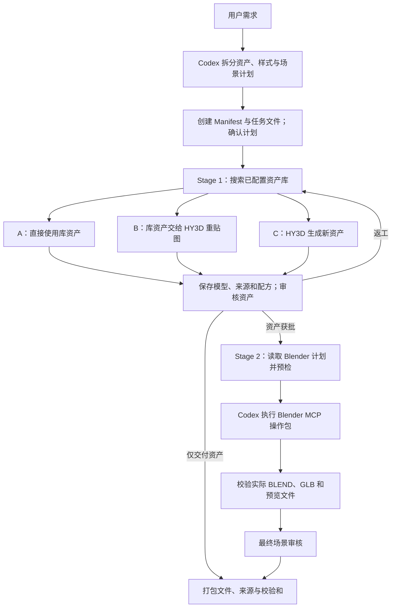

# Two-Stage 3D

把一段场景需求变成**可审核、可返工、保留来源的 3D 资产和 Blender 场景**。本项目由 Codex Skill 和 Python 运行时组成：Codex 理解需求、制定计划和做美术判断，Python 负责检索、模型调用、文件校验和状态管理。

工作分成两阶段：**Stage 1 先获得并审核单个资产；Stage 2 再把获批资产放入 Blender 构建场景。** 可以只做规划、只交付资产，或使用已有资产直接构建场景。

当前约定是 Codex 通过 MCP 控制 Blender，HY3D 在远程 GPU 服务器推理，通过 SSH 隧道接入。根据用户提供的部署记录，Hunyuan3D-2.1 的环境、扩展和权重已就绪，但记录明确没有启动 API 服务，也没有完成端到端推理。本仓库尚未完成网关适配和真实联调。

## 一次建模任务怎样运行



1. **规划**：Codex 从 `SKILL.md` 的 Execution Router 进入，结合 `prompts/` 理解需求，通过 CLI 创建项目、资产任务与样式文件。`init --brief` 只保存需求，Python 不会自行调用语言模型分解任务。
2. **检索与路由**：`asset_search.py` 调用 `providers/`，`asset_router.py` 按 `policies/` 选择 A/B/C。先检索再决策；检索服务失败不能当成“没有资产”直接生成。当前实际资产库适配器是本地目录。
3. **获取与审核**：`stage1_executor.py` 复制库资产或通过 `hy3d_client.py` 请求模型，保存结果及来源，进入 `review_required`。B 当前仅支持 B1 重贴图。未经批准的资产不能进入场景计划执行。
4. **场景构建**：`stage2_executor.py` 预检，`blender_mcp.py` 准备操作包，Codex 通过 MCP 让 Blender 执行 `blender_worker.py` 的加载、组装、导出和渲染。创建新场景，保留已有场景。
5. **验证与交付**：`stage2-complete` 检查真实输出和输入版本，然后才能审核场景。`delivery_executor.py` 打包获批资产或场景，保留来源声明、Manifest 快照和校验和。操作包或排队渲染不代表构建完成。

`manifest_manager.py` 是正式状态的写入入口；`state_machine.py` 和 `validators.py` 检查阶段、格式、路径及审批约束。返工生成资产的新版本，不覆盖既有结果。

## 文件在哪里，各自负责什么

| 文件 / 目录 | 作用与所在阶段 |
| --- | --- |
| `SKILL.md` | Codex 的编排入口，决定何时规划、调用工具、审核和结束 |
| `docs/workflow.md`、`prompts/` | 规划、资产审核和 Blender 操作的详细指导 |
| `runtime/cli.py`、`scripts/two-stage-3d.ps1` | 统一命令入口；PowerShell 脚本帮助本机选择 Python |
| `runtime/planning.py` | 将规划输入落为项目文件 |
| `runtime/asset_search.py`、`runtime/asset_router.py`、`providers/` | 搜索候选资产及 A/B/C 路由 |
| `runtime/stage1_executor.py` | 执行单资产获取，记录版本、来源和配方 |
| `runtime/hy3d_client.py`、`runtime/ssh_transport.py` | HY3D HTTP 协议、SSH 转发与环境检查 |
| `runtime/env_config.py`、`configs/hy3d_ssh.yaml`、`.env.example` | 部署参数读取与配置样例；真实连接值保存在被忽略的 `.env` |
| `runtime/stage2_executor.py`、`runtime/blender_mcp.py`、`runtime/blender_worker.py` | 场景预检、MCP 操作包与 Blender 内执行代码 |
| `runtime/manifest_manager.py`、`runtime/state_machine.py`、`runtime/validators.py` | 正式状态、审核门禁、版本及文件校验 |
| `runtime/delivery_executor.py` | 交付打包 |
| `contracts/` | Manifest、任务、候选、Stage 1 结果、Blender 计划、审核、交付等 JSON Schema |
| `templates/`、`policies/` | 可编辑的输入起点，以及路由、许可、状态规则 |
| `examples/library/` | 自带原创 CC0 长椅、资产目录和许可说明，用于离线验证 |
| `projects/` | 实际建模任务的输入与产物，不属于 Skill 源码验收快照 |
| `interface.json`、`requirements.json`、`tests/manifest.json` | Skill 文件依赖、需求断言及测试证据关系 |
| `tests/`、`changes/`、`scripts/govern.ps1` | 回归测试、正式版本记录和迭代验收入口 |
| `two_stage_3d_skill_codex_spec_v0.1.md` | 初始设计规格；当前实现以运行时和验收记录为准 |

一个项目的文件按下面的顺序产生或被读取：

```text
projects/<项目名>/
  user_brief.md                    原始需求
  manifest.yaml                    项目模式、资产状态、审批和输出索引
  style_bible.yaml                 两阶段共用的样式约定
  planning/                       规划资料目录
  stage1/
    tasks/<asset_id>.yaml          单资产任务
    candidates/                   检索候选与评分记录
    sources/                      原始库资产
    outputs/                      各资产各版本的模型
    results/<asset_id>_rev00.json   模型路径、来源、校验和与生成配方
    reviews/                      资产审核与返工意见
  stage2/
    blender_plan.yaml             Codex 提供的布局、几何、摄影机和灯光计划
    scene/mcp-<编号>/              请求、执行票据、MCP 操作包及实际场景输出
    reviews/                      场景审核记录
  delivery/outputs/package-*/      交付文件、来源声明、快照与校验和
```

`init` 创建目录、Manifest、需求、样式和任务；Blender 计划由 Codex 后续提供，其他结果随执行产生。模板不会自动成为经过用户确认的设计。

## 先跑一个离线资产示例

本地运行时需要 Python 3.11+。在仓库根目录安装：

```powershell
python -m venv .venv
.\.venv\Scripts\Activate.ps1
python -m pip install -e '.[dev]'
```

当前开发机也可使用 `scripts/two-stage-3d.ps1`，它优先寻找项目虚拟环境或系统 Python，再寻找 Codex 自带 Python，并加载现有 `.deps/`。以下命令中的 `python -m runtime.cli` 可替换为 `.\scripts\two-stage-3d.ps1`。依赖声明见 `pyproject.toml`，已测试版本见 `requirements-tested.txt`。

以下示例使用新项目目录，只复制仓库内的长椅，不连接远程服务器或 Blender。执行计划批准命令前应确认示例任务符合意图。

<!-- executable: offline-asset -->
```powershell
python -m runtime.cli init projects/readme_demo --id readme_demo --brief '安静的乡间车站' --mode full_pipeline --task templates/asset_task.yaml
python -m runtime.cli approve-plan projects/readme_demo
python -m runtime.cli stage1 projects/readme_demo --asset-id bench --catalog examples/library/catalog.yaml
python -m runtime.cli status projects/readme_demo
```

预期：`stage1/results/bench_rev00.json` 记录 `library_direct` 路由，实际模型位于 `stage1/outputs/`，长椅状态为 `review_required`。先检查模型与来源，再执行批准及后续命令：

```powershell
.\scripts\two-stage-3d.ps1 review projects/readme_demo bench --decision approved
Copy-Item templates/blender_plan.yaml projects/readme_demo/stage2/blender_plan.yaml
.\scripts\two-stage-3d.ps1 stage2 projects/readme_demo --dry-run
.\scripts\two-stage-3d.ps1 stage2 projects/readme_demo
```

`--dry-run` 只预检。下一条命令准备 MCP 操作包，**需要 Codex 通过 Blender MCP 实际执行**；CLI 不直接调用 Codex 会话工具。执行及输出回收步骤见 [MCP 接入说明](docs/mcp_and_ssh.md)。用返回的真实 build_id 完成回收，检查预览和场景后再批准交付：

```powershell
.\scripts\two-stage-3d.ps1 stage2-complete projects/readme_demo --build-id mcp-实际编号
.\scripts\two-stage-3d.ps1 approve-final projects/readme_demo
.\scripts\two-stage-3d.ps1 deliver projects/readme_demo
```

只需要已批准的资产时，可设置 `configure <project> --target asset` 后 `deliver <project>`，不需要构建 Blender 场景。

| 模式 | 行为 |
| --- | --- |
| `plan_only` | 默认，只保存和展示计划 |
| `stage1_only` | 获取资产，在审核处停下 |
| `stage2_only` | 使用 `supply` 导入的已有资产和来源，不执行检索 |
| `full_pipeline` | 两阶段执行，仍保留审核节点 |
| `repair` | 针对指定资产返工，保留旧版本并受版本次数限制 |

`run` 按保存模式继续，处理待执行资产与已请求的返工；失败资产保持待处理，确认远程任务结果后可显式选择重试。`run --asset-id ID` 只处理指定资产并停在资产检查点，即使开启自动审核也不会继续构建场景；`stage1 --asset-id ID` 仍可显式执行单项。自动审核需要明确启用 `configure --auto-approve`，部分场景需要明确启用 `--allow-partial`；这些选项不会让计划里列出的未批准资产通过。更多命令见 `--help` 和 [操作指导](docs/workflow.md)。

## 远程模型的调用方式与接口

**已有明确协议，客户端已实现；远程服务需要实现本项目网关协议 v0.1，或增加适配层。** 仅部署模型权重、推理脚本或原生 Web UI，不能据此认定接口已经兼容。本仓库不包含远程推理服务器或模型权重。

用户提供的本地部署报告位于 `ssh-deployment-report/DEPLOYMENT.md`（外部部署证据，不纳入 Skill 源码验收快照）。它记录了 Hunyuan3D-2.1、Python 3.10.21、torch 2.5.1+cu124、A100 40 GB，Shape/Paint 权重及导入检查已完成。远程 Python 环境独立于本地运行时，不需要升级到本地要求的 Python 3.11。远程依赖中的 bpy 4.0 也不等同于 Stage 2 的 Blender MCP 宿主。

报告中没有 HTTP 监听端口或 API 启动命令；SSH 端口和模型服务端口是不同配置。报告还要求显式分配单张 GPU，默认隐藏 GPU；提供连接信息不等于已授权运行推理。下一步是确认 GPU 分配、实现并启动兼容网关，再做真实任务验证。实际 SSH 别名、端口及远程路径只写入本地部署配置，不复制到共享配置样例。

```text
本地 Stage1Executor → Hy3DClient → 本机 127.0.0.1:local_port
  → SSH 隧道 → 服务器 127.0.0.1:remote_port → 网关/适配层 → 模型推理
  ← JSON 中的 model_base64 ← 完整 GLB 文件
```

| 请求 | 用途 / 约定 |
| --- | --- |
| `GET /health` | 返回 `status: "ok"` 和 `capabilities` 数组，只声明实际支持的能力 |
| `POST /v1/generate_shape` | 生成几何模型 |
| `POST /v1/generate_textured_asset` | 生成带材质的资产 |
| `POST /v1/retexture_mesh` | 对传入网格重贴图 |

生成前会先调用健康检查并核对所需能力。POST 使用 JSON，字段为 `prompt`、`reference_images`、`style_bible`、`seed`；重贴图额外传 `mesh`。图片和网格以 `{name, data_base64}` 传输。成功响应必须同步返回 `{"model_base64":"完整 GLB 的 Base64"}`；不支持直接返回服务器路径、下载 URL 或异步 job_id。失败返回非 2xx。完整示例与限制见 [网关协议](docs/hy3d_gateway.md)，实现见 [hy3d_client.py](runtime/hy3d_client.py)。

接入已部署的模型时：

1. 核对模型名称/版本、启动方式、接口文档或请求样例、服务端口，以及是否异步返回任务。接口不同时，先适配参数、状态和 GLB 输出。
2. 参考 `.env.example` 填写根目录 `.env` 的 SSH 主机/别名、端口、账户、可选密钥路径、转发端口和超时。不要覆盖已有 `.env`。真实值不写入版本库；进程环境变量优先于 `.env`。
3. 配置模板指定 `token_env: HY3D_API_TOKEN`，因此必须提供非空令牌；客户端使用 `Authorization: Bearer ...`。若网关明确不需要鉴权，应在所用配置中移除 `token_env`，空令牌不会自动禁用鉴权。
4. 执行下面的 SSH 检查与协议健康检查。SSH 使用严格主机密钥验证；服务通过服务器回环端口转发。每次 HTTP 请求单独打开并清理隧道。
5. 根据实际模型输出使用条款配置 `output_source`；C 路由在缺少已核实来源许可时阻止生成。随后用一项获准任务验证真实推理、GLB 回传和资产审核。

```powershell
.\scripts\two-stage-3d.ps1 ssh-check --config configs/hy3d_ssh.yaml
.\scripts\two-stage-3d.ps1 hy3d-health --config configs/hy3d_ssh.yaml
.\scripts\two-stage-3d.ps1 stage1 projects/my_station --asset-id bench --catalog examples/library/catalog.yaml --hy3d-config configs/hy3d_ssh.yaml
```

最后一条命令要求已有相应项目、获批计划和任务，是否调用 HY3D 由路由决定；库资产直接命中时不触发推理。健康检查通过也不等于完成推理。超时后先检查服务端任务，不自动重复昂贵生成。当前 `.env.example` 的请求超时是 300 秒，可按实测耗时配置 `HY3D_TIMEOUT_S`。

## 当前能力边界

已实现本地资产库检索、A/B/C 路由、审批和返工、远程模型客户端、默认 Blender MCP 操作包及输出回收、资产/场景交付。支持嵌入资源的 GLB 和不引用 MTL 的纯几何 OBJ；输出许可当前仅接受已核实的 `cc0` 或 `cc_by`，后者需要归属声明。

远程资产库、B2/B3 细化、自动视觉评分、并行 Worker 调度和 Web 交付尚未实现。Blender 工作者面向 4.2+，不会自动修复复杂拓扑或推断全部尺寸；技术文件检查不等于美术验收。默认按 Blender 能访问本机项目路径设计，若 Blender 也放到远程，仍需文件同步与路径映射。批处理后端必须显式选择，MCP 断开时不自动切换。

自动测试包含实际文件流和本地 HTTP 网关交互；SSH/MCP 进程边界使用测试替身。本次文档更新不宣称已连接用户服务器或完成真实 Blender 渲染。真实集成与美术质量仍保留为未完成验证项。

## 怎样迭代这个 Skill

所有迭代必须遵循 `D:/contract-govern skill/` 定义的范式和 [项目迭代步骤](docs/governance/EVOLVE.md)：需求与 claims → 测试先行 → 影响分析 → 修改 → 契约与历史回归 → 正式验收。

```powershell
.\scripts\govern.ps1 validate
.\scripts\govern.ps1 contract-test
.\scripts\govern.ps1 test
```

版本接受使用该文档中的 `accept` 流程，由工具生成 `changes/` 记录，不能手写成功证据或弱化历史测试。治理版本记录在 `interface.json`，独立于 Python 包版本 `0.1.0` 和生产数据 Schema 版本 `0.1`。治理副本不包含实际 `projects/`、`.deps/`、`.env`；报告位于 `.skillctl/reports/`。
