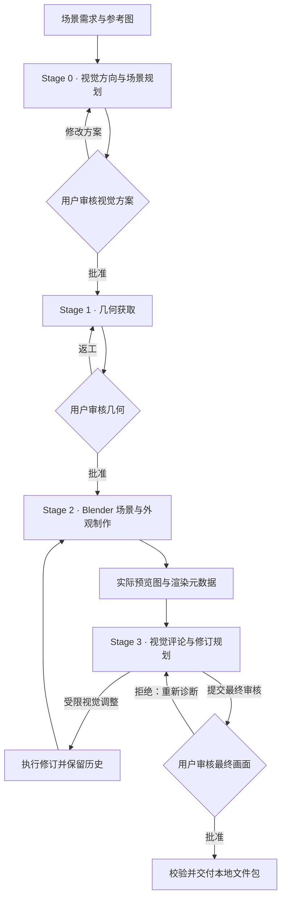

# Visual Scene Production Skill

**由 Codex 编排的 3D 视觉场景生产框架：将场景需求与参考图，逐步转化为可审核、可返工、保留来源的 Blender 场景。**

项目最初以 `Two-Stage 3D` 命名，只有资产获取和场景组装两个阶段。当前 v0.2 已扩展为 **Stage 0–3 四阶段流程，并贯穿用户审核与交付**。仓库 `3D-2stages`、Skill 标识 `two-stage-3d` 和 Python 命令保留兼容名称；这些名称不再代表当前架构的阶段数量。

## 项目定义

本项目将场景制作中的美术判断与确定性执行连接起来：Codex 理解需求、规划场景并检查实际画面；Python 运行时管理文件、来源、版本与审核门禁；Blender 执行几何、材质、灯光、相机和渲染操作。

适用范围是**静态环境、建筑与站台等场景原型、工业硬表面道具，以及已有资产的统一风格组装**。用户可以先审方向，再审几何和最终画面，在保留历史的前提下逐轮调整。

生产编排从 [SKILL.md](SKILL.md) 进入。CLI 提供各阶段的确定性操作，视觉理解和美术评价仍由 Codex 根据实际参考与渲染图完成；Python 运行时本身不启动一个自主美术 Agent。

## 四阶段生产框架



| 阶段 | 负责什么 | 主要产物 |
| --- | --- | --- |
| **Stage 0 · Visual Direction** | 解释需求与参考用途，明确情绪、构图、对象、尺度、层次和风格选择 | `visual_brief`、`reference_board`、`scene_spec`、`style_assignment` |
| **Stage 1 · Geometry Acquisition** | 先搜索已配置的本地资产库，再选择直接使用、缩放修改、生成或程序化几何；记录来源并等待审核 | 几何结果、模型或程序化配方、语义信息、原始表面来源与审核记录 |
| **Stage 2 · Scene & Look Development** | 分别处理布局、语义材质、灯光、氛围、相机和渲染计划，通过 Blender MCP 执行 | `blockout_plan`、`semantic_material_map`、`lookdev_plan`、`render_plan`、BLEND、预览 PNG 与元数据 |
| **Stage 3 · Visual Critic & Revision** | 查看实际预览，诊断视觉问题，提交结构化评论和允许范围内的修订计划 | `visual_review`、`revision_plan`、后续预览与修订历史 |

视觉方案、几何与最终画面的审核是不同门禁。默认模式为 `plan_only`；保存计划、准备操作包、排队渲染或通过文件校验，都不会代替实际执行或用户批准。

## 组件职责与架构原则

| 组件 | 职责 |
| --- | --- |
| **Codex / Skill** | 理解需求，解释参考图，规划几何和视觉方向，选择语义操作，查看画面并提出修订 |
| **Python Runtime** | 检索与路由、协议调用、契约检查、来源与版本管理、审核门禁、交付校验；`ManifestManager` 是正式项目状态的唯一写入入口 |
| **Style System** | 将语义材质类别和风格配置落实为 Blender 材质、灯光、氛围、相机与颜色管理参数 |
| **Blender / MCP** | 执行导入、放置、程序化几何、材质赋值、灯光、相机与真实渲染 |
| **Hunyuan3D（可选远程后端）** | 提供几何候选和可选的原始表面证据；最终外观由场景的 Style Profile 决定 |

核心关系是：**几何来源与最终风格分离，视觉评论与执行分离，技术校验与美术批准分离。** 库资产、程序化几何和生成几何进入同一套场景与材质流程；改变灯光、相机等视觉配置时，运行时检查获批几何的一致性。

## 当前能做什么

- **把需求和参考整理成可审核方案。** 导入参考原始文件与来源，区分构图、材质语言、几何等用途，保存版本化的视觉简报和场景规格。
- **获取和组合几何。** v0.2 支持 A 直接使用库资产、B 对库资产做明确缩放修改、C 调用生成后端、D 程序化几何。程序化构件包括地面、墙、平台、柱、栏杆和管道，可组合成更大的场景结构。
- **统一场景材质与风格。** `industrial_acg_v1` 包含可执行 Blender 材质库、校准场景及灯光、相机、颜色管理和评论规则。默认 1.0.0 提供六类材质；显式 1.1.0 增加植被及风格细化。目前可执行类别为涂漆金属、裸金属、混凝土、橡胶、玻璃、发光、植被，支持 clean、lightly_weathered、weathered 三种状态。
- **制作并验证真实预览。** 分开提交布局、材质和渲染计划，通过 MCP 执行后核验实际 PNG、BLEND、执行回执、输入版本与几何指纹。失败和重渲染均保留记录。
- **根据画面进行受限返工。** Codex 提交视觉诊断后，可调整粗糙度变化、灯光强度与方向、雾量、相机构图、曝光。最多三次预览尝试，包含初次预览和失败尝试；几何替换或重新生成需要另行审核。
- **交付可核对的场景文件。** 明确批准当前最终画面后，打包已有预览、setup BLEND、布局文件、正式文档、来源、修订历史、依赖版本副本和 Manifest 快照。交付清单记录文件哈希，重复交付会重新校验已登记内容。

## 产物与使用范围

| 用户拿到什么 | 当前含义 |
| --- | --- |
| 视觉方案与场景规格 | 可审阅、可版本化的制作输入；模板本身不是获批设计 |
| 几何与来源记录 | 已获取的模型或程序化配方，以及可追溯的来源、版本和审核信息 |
| Blender 场景与 PNG | 实际构建的场景文件和已完成的预览；准备请求不算输出 |
| 评论与返工历史 | 每一轮评论关联具体图片和版本，修订不覆盖旧记录 |
| 本地交付包 | 当前获批结果及其来源、依赖和校验清单；跨机器执行前重新生成含宿主路径的 MCP 操作包 |

当前重点是环境场景的制作、视觉迭代与本地交付。角色绑定、动画、游戏引擎集成、在线发布、模型训练和复杂拓扑自动修复不在现有能力范围内。

## 从一个离线视觉方案开始

本地运行时需要 Python 3.11+。在专用 Conda 或虚拟环境中、仓库根目录执行；不要向 base、系统 Python 或其他用途的环境安装依赖。

```text
python -m pip install -e .
python -m runtime.cli doctor
```

`doctor` 只检查本机发现结果。Blender 最低 4.2，当前真实验证基线为 **4.5.13 LTS + MCP**。本地 Python、MCP、Blender 自带 Python 和远程模型环境分别管理。平台安装与路径规则见 [平台说明](docs/platforms.md)，远程连接见 [MCP / SSH](docs/mcp_and_ssh.md)。

下面的例子只做 Stage 0，不要求 Blender 或 HY3D 在线。使用尚不存在的 `projects/v02_demo`：

<!-- executable: readme-visual-start -->
```text
python -m runtime.cli init-v02 projects/v02_demo --id v02_demo --brief "Quiet industrial station with matte teal equipment and warm concrete"
python -m runtime.cli reference-add-v02 projects/v02_demo examples/v02/reference.svg --id ref_material --role material_language --source examples/v02/reference_source.yaml
python -m runtime.cli stage0-submit projects/v02_demo --proposal templates/v02_stage0.yaml --expected-version 0
python -m runtime.cli status projects/v02_demo
```

完成后应处于 `plan_only / visual_review_required`，Manifest 版本为 1，审批记录为空；四份视觉文档与原创参考已保存。下一步由用户审核方案，再授权几何获取。

各阶段的具体命令和前置条件见 [快速入门](docs/v02/quickstart.md)、[几何获取](docs/v02/geometry.md)、[场景制作](docs/v02/production.md)、[预览](docs/v02/preview.md)、[视觉评论](docs/v02/visual-review.md)、[受限修订](docs/v02/controlled-revision.md)、[最终审核与交付](docs/v02/delivery.md)。

## 已实现范围与限制

- **素材输入：** 当前资产库适配器是本地目录。支持嵌入资源的 GLB 和不引用 MTL 的纯几何 OBJ；HY3D 表面解析不支持 Draco、meshopt 或稀疏 UV。远程资产库尚未实现。
- **材质粒度：** 每个语义对象目前支持一个 `body` 材质槽；不同部件需要不同材质时，先拆分语义对象。`asphalt` 已预留契约词汇，但还没有可执行材质实现。
- **HY3D 表面：** 可保存原始 Paint 结果作来源证据，目前不支持将它混合进最终语义材质。真实模型权重和远程网关不包含在本仓库；接入需满足 [网关协议](docs/hy3d_gateway.md) 与 [来源规则](docs/hy3d-provenance.md)。
- **输出与迁移：** v0.2 交付已有预览和 setup BLEND，目前没有独立的高质量 `final-render`、v0.2 GLB 导出或 Web 发布流程。`migrate-v02` 只生成只读迁移草案，不直接安装或改写旧项目。
- **自动化边界：** 视觉评分是 Codex 对实际图像的判断，不是确定性美术分数。当前没有并行 Worker 调度器；MCP 失败不会自动改用 batch。没有获批几何、真实执行结果或明确最终批准时，流程会停在对应门禁。

核心实现已经通过活动历史回归和契约检查，并有真实 Blender 材质校准、两轮预览、受限修订、交付与 BLEND 重载证据。工程集成测试中的模拟审核决定不代表用户已批准正式车站。

**完整 v0.2 视觉验收仍待完成：** 真实 HY3D 推理及原始/风格化对比因显存不足暂停；标准混合来源车站还需要最终画面审核。服务健康检查和本地测试替身不能代替这些证据。

## 兼容与维护

`init-v02` 创建当前视觉流程的 Schema 0.2 项目。旧 `init`、`run`、`stage1`、`stage2` 等命令继续服务 Schema 0.1 项目，不会静默迁移；旧流程中的 B1 重贴图与 v0.2 的几何缩放修改含义不同。旧资产流程详见 [工作流说明](docs/workflow.md)。

<details>
<summary>保留的 v0.1 离线资产示例</summary>

以下命令只复制自带长椅，并停在资产待审状态。执行计划批准前，应先确认示例任务符合意图；它不是新视觉场景的推荐入口。

<!-- executable: offline-asset -->
```powershell
python -m runtime.cli init projects/readme_demo --id readme_demo --brief '安静的乡间车站' --mode full_pipeline --task templates/asset_task.yaml
python -m runtime.cli approve-plan projects/readme_demo
python -m runtime.cli stage1 projects/readme_demo --asset-id bench --catalog examples/library/catalog.yaml
python -m runtime.cli status projects/readme_demo
```

预期实际保存长椅模型与来源，路由为 `library_direct`，资产状态为 `review_required`。此示例不连接 Blender 或远程推理服务。

</details>

`runtime-v0.2` 分支分发运行所需代码、资源、配置模板和指南；完整维护 checkout 另外保留测试与验收历史。真实项目、凭据、模型权重和治理缓存不属于运行分发。源代码、契约与资源的职责见 [SKILL.md](SKILL.md) 和 [契约说明](docs/v02/contracts.md)。

修改 Skill 必须在具备完整维护资料的 checkout 中，依照 [AGENTS.md](AGENTS.md) 与 [Contract-Governed 维护步骤](docs/governance/EVOLVE.md) 执行。`interface.json` 的治理版本、Python 包版本、生产 Schema 和风格版本各自独立；已实现或已发布不等于正式接受，正式接受状态以工具生成的 `changes/` 记录为准。
