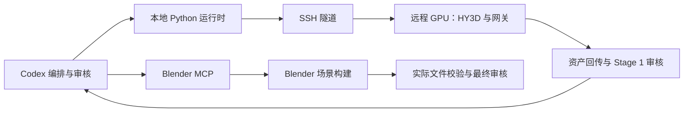

# Blender MCP + 远程 HY3D

本项目当前采用以下执行方式：



本机负责规划、检索、保存资产和审核；HY3D 推理在远程服务器。当前 Blender MCP 按可访问本机项目目录设计。若以后 Blender 本身也迁移到另一台机器，需要再增加文件同步/路径映射，不能把本机绝对路径直接发给另一台机器。

## Blender 连接与执行

Codex 会话已经提供 `get_addon_status`、`get_scene_info`、`execute_blender_code` 等 Blender MCP 工具。最近只读检查返回无法连接 Blender。启动 Blender 中的 MCP 插件服务后，再通过 `get_addon_status` 验证连接；工具存在不代表插件已经在线。

不需要把 Blender 程序加入系统 PATH，也不需要额外启动后台 Blender。当前 CLI 默认 `--backend mcp`：

```powershell
.\scripts\two-stage-3d.ps1 stage2 projects/my_station
```

运行时先验证审批、路径和输入，再生成独立目录下的 `request.json`、`ticket.json` 和 `mcp_calls.json`。Codex 读取操作包，通过 MCP 依次执行：

1. **load**：校验 Manifest、计划、样式、资产和工作者文件的摘要，确认 Blender 能访问共享目录。
2. **assemble**：创建新场景，导入资产并设置几何、摄影机和灯光。
3. **export**：导出新场景的 BLEND/GLB；保留当前文件与原有场景。
4. **render**：排队生成预览。执行 `status_code` 查看排队、渲染、完成或失败状态。

每个执行步骤都重新检查输入。审核被撤销或文件发生变化时，旧操作包会停止。导出和渲染不允许重复覆盖同一个任务的文件。MCP 超时不代表 Blender 没执行，先检查状态，不要再次提交同一步骤。

实际文件产生后，Codex 执行：

```powershell
.\scripts\two-stage-3d.ps1 stage2-complete projects/my_station --build-id mcp-实际编号
```

只有文件存在、格式初检通过、项目版本和输入仍然一致，才登记 `built`。随后仍需最终审核。操作包不是场景产物，MCP 返回一句成功也不能替代文件验证。

当前批处理替代入口是 `stage2 --backend batch --blender <程序路径>`，仅在明确选择时使用。

## HY3D SSH 配置

服务器尚未准备，因此 [配置文件](../configs/hy3d_ssh.yaml) 只保留 `${HY3D_*}` 环境引用，根目录 `.env` 中的 `HY3D_SSH_HOST` 和账户相关值保持空白。这不代表已经连接或部署。

服务器准备后需要：主机/IP 或 SSH 别名、SSH 端口、用户名，以及密钥路径或可用的 SSH Agent。真实值写入已被 Git 忽略的 `.env`，不写入 YAML、文档或 `.env.example`。`HY3D_SSH_IDENTITY_FILE` 留空表示交给 OpenSSH 默认身份/Agent；显式密钥路径支持空格。私钥内容和密码不落盘，带口令密钥应先在 SSH Agent 中解锁。

配置字段：

| 字段 | 用途 |
| --- | --- |
| `ssh.host` | 主机、IP 或已有 SSH 配置别名 |
| `ssh.port` | SSH 端口，默认 22；非标准端口需明确填写 |
| `ssh.user` | 远程用户名；空值时由 OpenSSH 决定 |
| `ssh.identity_file` | 可选的本地私钥文件路径 |
| `ssh.known_hosts_file` | 可选的已核实主机密钥文件路径 |
| `ssh.local_port` | 本机隧道端口，默认 18080 |
| `ssh.remote_port` | 服务器本机网关端口，默认 8080 |
| `timeout_s` | 单次服务请求的超时，当前模板为 900 秒 |

SSH 使用严格主机密钥校验，不自动接受未知服务器。首次连接时应核对云平台提供的指纹，并通过正常 SSH 流程登记主机密钥。连接失败时会保留错误信息供排查；不静默关闭密钥校验。端口转发和主机校验行为参照 [OpenSSH 官方手册](https://man.openbsd.org/ssh)。

部署顺序：

1. 参考 `.env.example` 填写根目录 `.env`，执行只读检查 `ssh-check`，确认 SSH、系统、Python 和 GPU/显存。
2. 根据硬件选择 HY3D 版本，在服务器安装环境、模型和匹配的服务适配层。当前还没有部署脚本，因为服务器系统和硬件尚未确定。
3. 服务绑定服务器自身的 `127.0.0.1:<remote_port>`，通过 SSH 隧道访问，执行 `hy3d-health`。
4. 核实模型输出许可，填写 `output_source`，再用一项获准的生成任务验证真实推理和资产回传。

```powershell
.\scripts\two-stage-3d.ps1 ssh-check --config configs/hy3d_ssh.yaml
.\scripts\two-stage-3d.ps1 hy3d-health --config configs/hy3d_ssh.yaml
.\scripts\two-stage-3d.ps1 stage1 projects/my_station --asset-id bench --catalog examples/library/catalog.yaml --hy3d-config configs/hy3d_ssh.yaml
```

SSH 隧道只负责传输。远程服务还需要实现 [本项目网关协议](hy3d_gateway.md)，不能直接假定任意原生 HY3D API 与其兼容。每次请求结束都会关闭本次创建的隧道；网络失败后不自动重复昂贵推理，先检查远程任务。

模型选型需结合形状生成和纹理生成的不同资源需求。作为候选参考，Hunyuan3D 2.1 官方仓库分别列出了形状、纹理和联合任务的显存要求，以及测试环境；等服务器准备后据此核对，不在本机预装其推理依赖。参见 [Hunyuan3D 2.1 官方安装说明](https://github.com/Tencent-Hunyuan/Hunyuan3D-2.1#get-started-with-hunyuan3d-21)。

## 当前验证状态

104 项自动测试覆盖 MCP 操作顺序、撤销审批后阻断执行、输出收集、SSH 字段校验、端口冲突拒绝、`.env` 配置解析、请求失败后的隧道清理，以及未配置时的明确错误。MCP 和 SSH 进程使用测试替身，不代表已经连接真实 Blender 或远程 GPU。真实联调等待插件服务在线和服务器准备完成。
